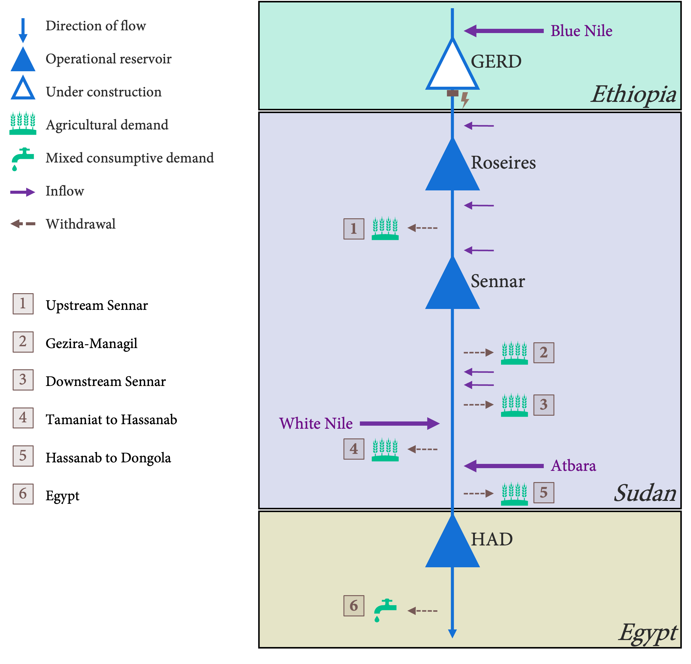
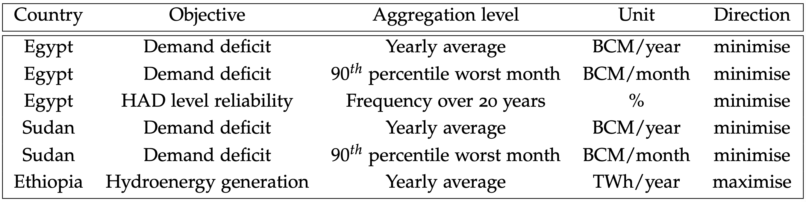

# Exploring Trade-offs in Reservoir Operations through Many Objective Optimisation

## Case of Nile River Basin

This repository includes the code associated with the [MSc. thesis project](https://repository.tudelft.nl/islandora/object/uuid%3Aba09fa13-5331-446c-bf5e-48f6a29042ca?collection=education) of Yasin Sari as the partial requirement for the Engineering and Policy Analysis programme of TU Delft. It concerns the model of the Eastern Nile System built from the perspective of the evolutionary multi-objective direct policy search (EMODPS) framework. 

 The model includes 4 reservoirs -- namely the Grand Ethiopian Renaissance Dam (GERD), Roseires, Sennar, and High Aswan Dam (HAD) as in figure 1.

 
<figcaption align = "center"><b>Figure 1 - Topological overview of the modelled system</b></figcaption>

 Policies which govern release decisions for these reservoirs are optimised with respect to six objectives that are presented in figure 2:


<figcaption align = "center"><b>Figure 2 - Objectives of the optimisation problem</b></figcaption>


Following the EMODPS methodology, release decisions are made by using a closed loop control policy that returns the decisions conditioned on dynamic inputs. Candidate control policies are initialised as a collection of radial basis functions (RBF). The aim of the optimisation is to find the parameter values of the release policies for near Pareto-optimal solutions. Users can resimulate optimised policies to obtain the performance metrics and physical quantities of the system with a particular policy. Various uncertainty analyses described in the thesis report can also be found in the output analysis section.

<!-- <!-- ## Repository Structure -->

```
+ master-thesis-project/
    • requirements.txt
    • README.md
   + nile_EMODPS_framework/
      + settings/
          • settings_file_Nile.xlsx
      + experimentation/
          • Profiling.ipynb
          • resimulation_under_scenarios.py
          • optimization_slurm.sh
          • data_generation.py
          • scenario_discovery_runs.py
          • exploration_slurm.sh
          • baseline_optimization.py
      + stochastic_data_generation_inputs/
          • IrrDemandUSSennar.txt
          • IrrDemandTaminiat.txt
          • atbara_distribution.csv
          • Data Validation.ipynb
          • IrrDemandDSSennar.txt
          • IrrDemandHassanab.txt
          • IrrDemandGezira.txt
          • mogren_distribution.csv
          • IrrDemandEgypt.txt
          • blue_nile_series.csv
          • 150ias_wheeler.csv
          • Baseline_wheeler.csv
          • 120Hurst_wheeler.csv
      + model/
          • model_nile_scenario.py
          • model_nile.py
          • model_classes.py
          • smash.py
      + data/
      + output_analysis/
          • output_analysis.ipynb
          • plotter.py
          • resimulation_analysis.ipynb
          • scenario_analysis.ipynb
          • convergence.ipynb
      + outputs/
         + archive_logs/
      + plots/
         + tables/
         + scenario_analysis/
         + resimulation/
         + baseline_optimization/
            + Gezira/
            + GERD/
            + HAD/
            + Egypt/
```

## How to Use

Firstly, package versions in the *requirements.txt* must be installed using pip. Evolutionary optimisation can be executed through *nile_EMODPS_framework/experimentation/baseline_optimization.py*. Post-optimisation analysis notebooks are in *nile_EMODPS_framework/output_analysis*.
